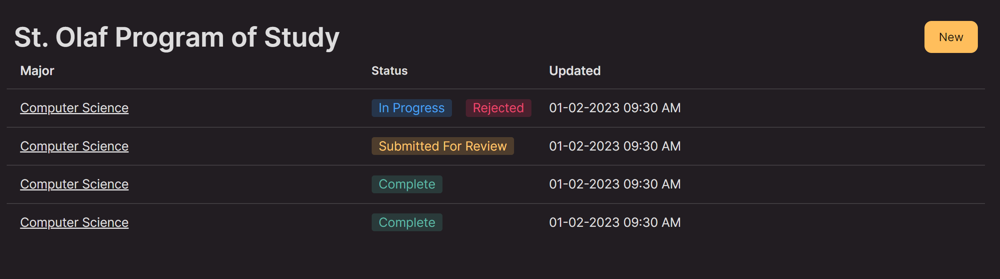
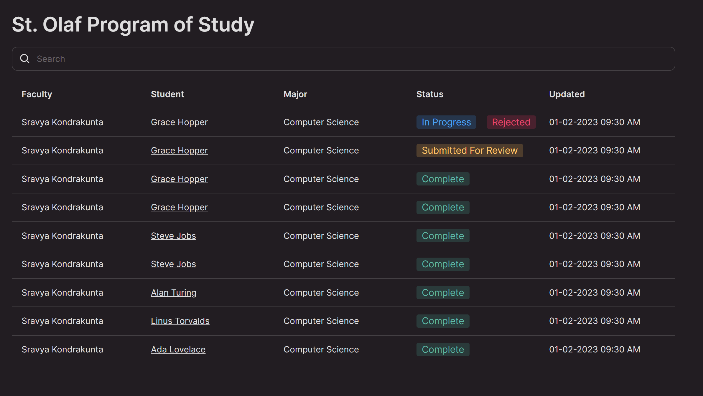
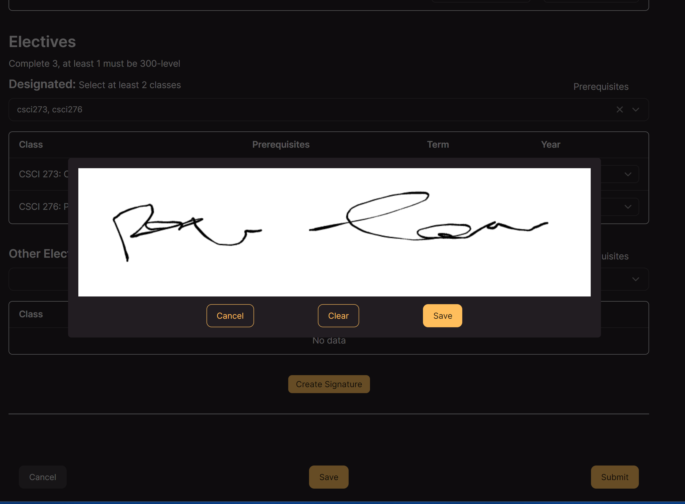
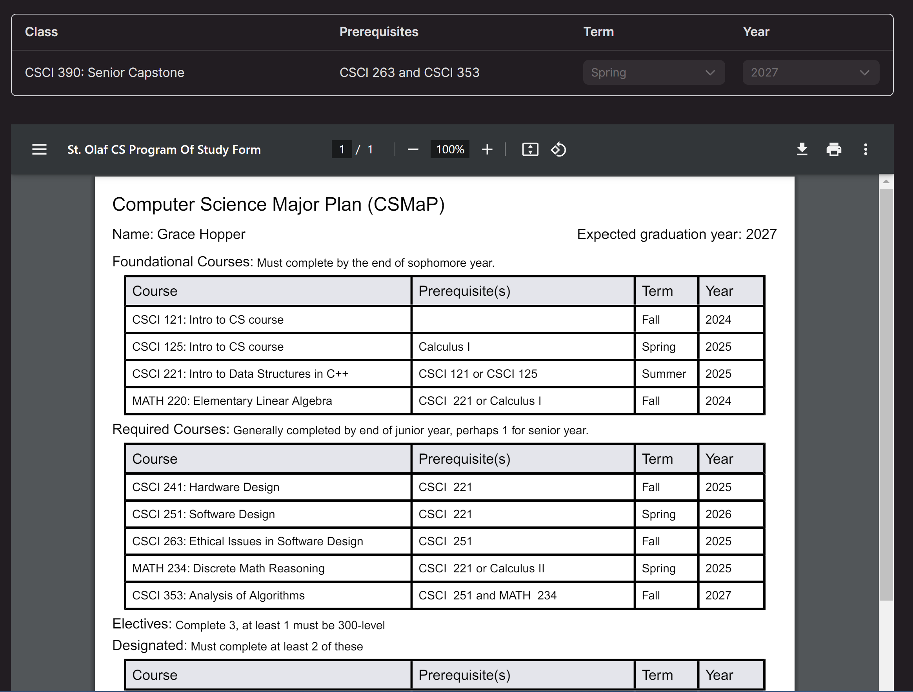

# St. Olaf Program of Study

St. Olaf Program of Study is a website that allows St. Olaf Students to plan for their four year major. It also allows for faculty to review and approve a student's plan. This integrates with the [POS Form Backend](https://github.com/kombofuud/pos-form-backend).

## Technologies List

- [Vite](https://vitejs.dev/)
- [TypeScript](https://www.typescriptlang.org/)
- [React](https://react.dev/)
- [React Router](https://reactrouter.com/en/main)
- [Gravity UI](https://gravity-ui.com/)
- [Tailwind](https://tailwindcss.com/)
- [Sass](https://sass-lang.com/)
- [ESlint](https://eslint.org/) & [Prettier](https://prettier.io/)
- [React Signature Canvas](https://www.npmjs.com/package/react-signature-canvas)
- [React PDF](https://react-pdf.org/)

## Figma Design

- [Figma Design Prototype](https://www.figma.com/design/4Qm4nWdzbU04dDLyzQJa6h/St.-Olaf-POS-Gravity-UI?node-id=48654-31725&t=s3r66BASvuKHDBZR-1)


## Screenshots

### Student Dashboard



### Faculty Dashboard



### Form


### Signature Modal



### PDF



## Dev

```sh
npm run dev
```

## To Do List

- Director View
- Authentication / Login Page
- Routing
- DB Connection
- API requests

## Completed

- Student View
  - Form
  - Rejection Reasons
  - PDF Generation
  - Signature
- Faculty View
  - Form
  - Rejection Reasons
  - Signature
